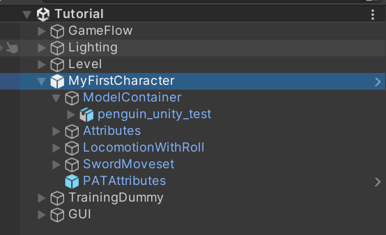

# Save the Penguin

<figure><figcaption></figcaption></figure>

***

## Goal

Create a controllable character built with Penguin Action Toolkit

* You may use the penguin or import your own assets

***

## Deliverable

1. A recording of your character defeating the boss

&#x20;     \-  You may as well edit the move set, attributes, and behaviors of the boss

2. Unity package which includes your character

***

## Sign Up



***


[schedule.md](schedule.md)



[terms-and-conditions.md](terms-and-conditions.md)

