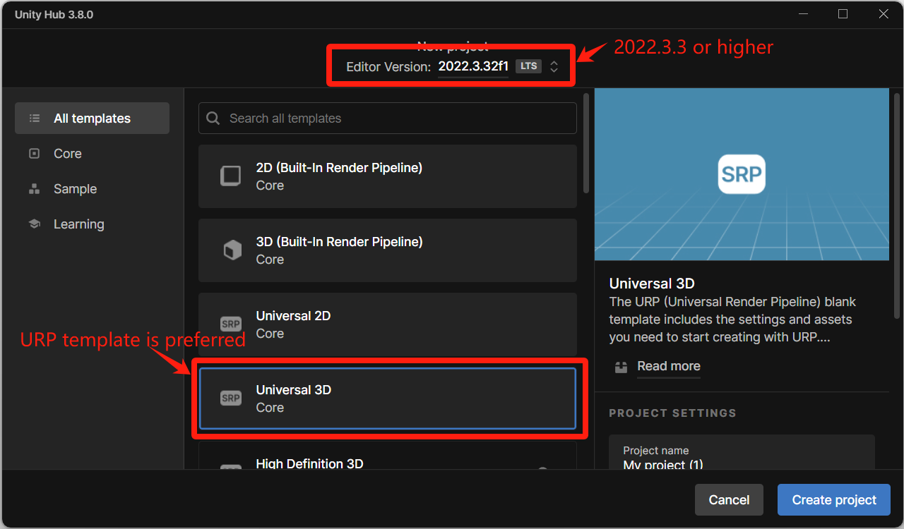

# Installation

### Video


Package Installation


### Step 1: Create a new Unity project

* **Suggested Unity version**: 2022.3.3 or higher
* [**Suggested template**](#user-content-fn-1)[^1]: URP (Universal Rendering Pipeline)

<figure><figcaption></figcaption></figure>

### Step 2: Import package

The latest Penguin Action Toolkit package is published on GitHub, and you can use <mark style="color:orange;">**either method**</mark> below to download and import it to your project.

#### <mark style="color:orange;">Method 1: Download .unitypackage and manually import it</mark>

1. Download the latest version from Google Drive [\[LINK\]](https://drive.google.com/file/d/1qOysJDM-toKpnNn25r3pL8aniJmGl6nB/view?usp=sharing).
2. Select **Custom Package** (Assets -> Import Package -> Custom Package...) to bring up a file browse.
3. Click the download package in your folder to import the package.
   1. Please install all dependencies required when asked by Unity.
4. After installing the dependencies, Unity will ask you to restart the editor. You might need to import the package again since the package window is closed after restart.&#x20;

#### <mark style="color:orange;">Method 2: Add package from git URL</mark>

1. Open the **Package Manager** window (Window -> Package Manager)
2. Click the **add**  button in the status bar on the left corner. The options for adding packages appear.
3. Select **Add package from git URL** from the add menu.
4. Copy and paste the git link below:

```
https://github.com/Nanasewww/penguin-action-toolkit.git#pat
```

5. Click **Add** and wait for about 2-3 minutes.&#x20;
6. Download the latest released package from GitHub [\[LINK\]](https://github.com/Nanasewww/penguin-action-toolkit). Make sure you have **unzipped** it.
7. Open the **Package Manager** window (Window -> Package Manager)
8. Click the **add**  button in the status bar on the left corner. The options for adding packages appear.
9. Select **Add package from disk** from the add menu to bring up a file browse.&#x20;
10. Click _package.json_ in your unzipped folder to import the package.&#x20;
11. Import sample assets. \
    Since we do encourage our users to modify the core scripts, it would be better for all the assets to be mutable. Before using PAT, please make sure you've imported the <mark style="color:orange;">**General Resources**</mark> in the Samples panel.&#x20;

<figure><figcaption></figcaption></figure>


[^1]: otherwise some demo assets may not work properly
