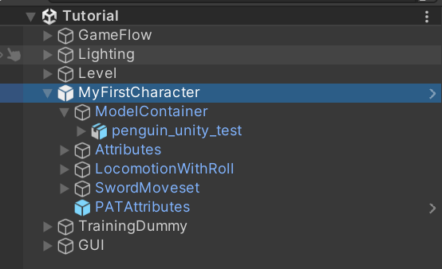

# Input

## Concept

Input Unit defines how Player Input is sent to character.&#x20;

For our native solution, we use Unity's Input System package as dependency since it has good controller supports and local muti-player solution. If you want to use old input system, you might need to override the player class and implement how tag is sent to character.

Expand the Input Unit's fold out, you will see this:

<figure><figcaption></figcaption></figure>

***

## Inspector

### Tag

What input tag to be sent to Character

### Action Ref

The input action that triggers this unit

### Hold Input

If unchecked, this input will only be triggered once per press event. Otherwise, it will be continuously triggered when holding the button

### Input Buffer Time

The amount of time this input tag will stay in the input tag list if it cannot trigger any action immediately. This will make your game's input windows more graceful.&#x20;

***

## Notice

Be aware that each input tag should only be matched to one input unit for the same player. If you want some more advance inputs like special commands/weapon input override, we will add documentation of the input addon class later.
